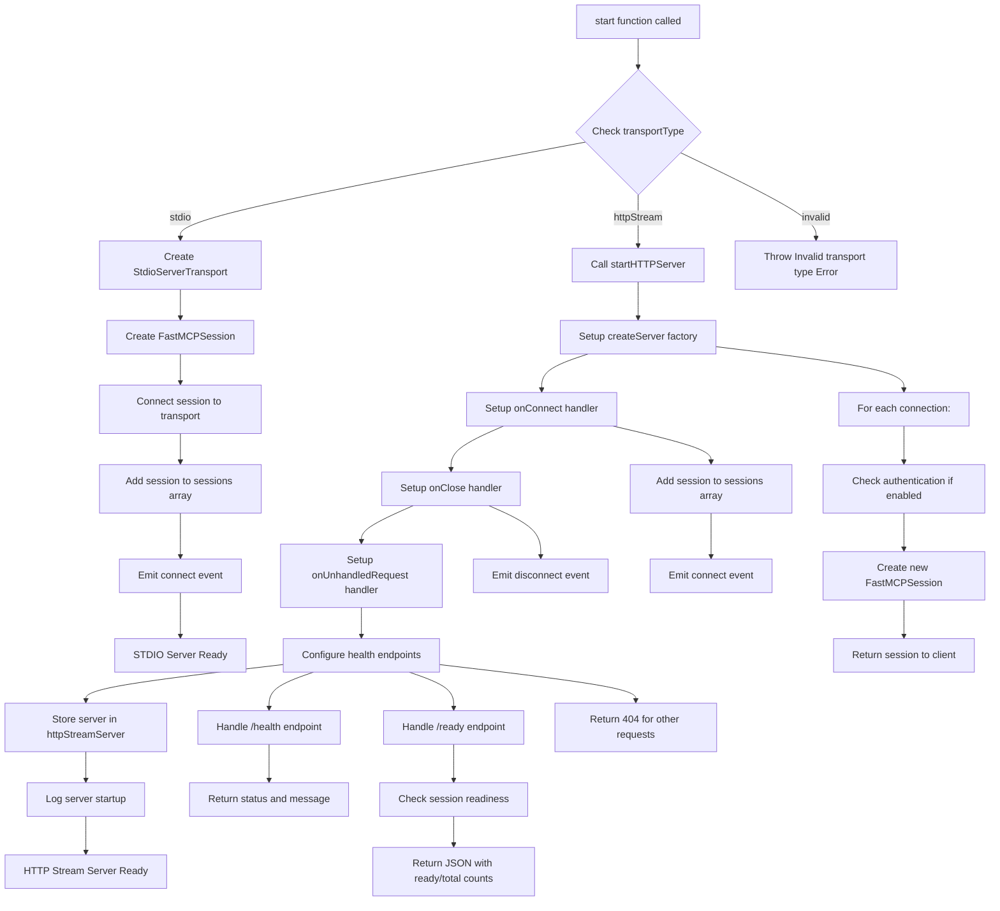

```mermaid
flowchart TD
A[start function called] --> B{Check transportType}

    B -->|stdio| C[Create StdioServerTransport]
    C --> D[Create FastMCPSession]
    D --> E[Connect session to transport]
    E --> F[Add session to sessions array]
    F --> G[Emit connect event]
    G --> H[STDIO Server Ready]

    B -->|httpStream| I[Call startHTTPServer]
    I --> J[Setup createServer factory]
    J --> K[Setup onConnect handler]
    K --> L[Setup onClose handler]
    L --> M[Setup onUnhandledRequest handler]
    M --> N[Configure health endpoints]
    N --> O[Store server in httpStreamServer]
    O --> P[Log server startup]
    P --> Q[HTTP Stream Server Ready]

    B -->|invalid| R[Throw Invalid transport type Error]

    J --> J1[For each connection:]
    J1 --> J2[Check authentication if enabled]
    J2 --> J3[Create new FastMCPSession]
    J3 --> J4[Return session to client]

    N --> N1[Handle /health endpoint]
    N --> N2[Handle /ready endpoint]
    N --> N3[Return 404 for other requests]

    K --> K1[Add session to sessions array]
    K1 --> K2[Emit connect event]

    L --> L1[Emit disconnect event]

    N1 --> N1A[Return status and message]
    N2 --> N2A[Check session readiness]
    N2A --> N2B[Return JSON with ready/total counts]
```
